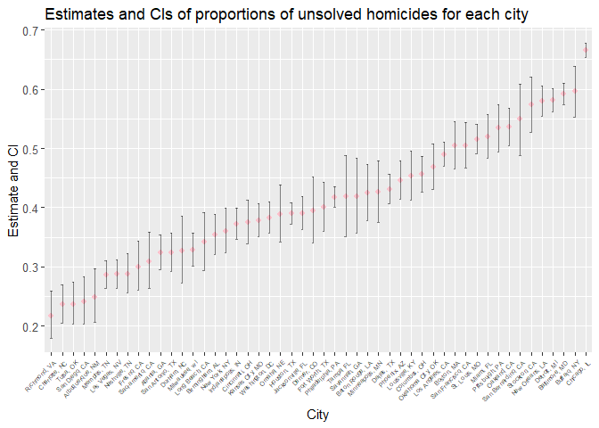

p8105\_hw5\_rj2543
================
rj2543
November 3, 2018

Problem 1
=========

The original zip file contains data from a longitudinal study that included a control arm and an experimental arm. Data for each participant is included in a separate file, and file names include the subject ID and arm.

Create a tidy dataframe containing data from all participants, including the subject ID, arm, and observations over time:

-   Start with a dataframe containing all file names; the list.files function will help

``` r
file = list.files(path = "./data") %>% # specify all file names, it may be more useful to use argument "full.names = TRUE" in order to do the following data import
  tibble()
  
file = rename(file, names = .) # make variable name meaningful

file
```

    ## # A tibble: 20 x 1
    ##    names     
    ##    <chr>     
    ##  1 con_01.csv
    ##  2 con_02.csv
    ##  3 con_03.csv
    ##  4 con_04.csv
    ##  5 con_05.csv
    ##  6 con_06.csv
    ##  7 con_07.csv
    ##  8 con_08.csv
    ##  9 con_09.csv
    ## 10 con_10.csv
    ## 11 exp_01.csv
    ## 12 exp_02.csv
    ## 13 exp_03.csv
    ## 14 exp_04.csv
    ## 15 exp_05.csv
    ## 16 exp_06.csv
    ## 17 exp_07.csv
    ## 18 exp_08.csv
    ## 19 exp_09.csv
    ## 20 exp_10.csv

-   Iterate over file names and read in data for each subject using purrr::map and saving the result as a new variable in the dataframe

``` r
file_read = function(x){ # write a function for read in data in the preferred way
    path = str_c("./data/", x) # define the relative path
    
    y = read_csv(path) %>% 
      mutate(patient = x) %>% 
      separate(patient, into = c("id", "remove"), sep = ".c") %>%  
      select(-remove) %>% # use subject ID instead of file name to specify
      select(id, everything()) # make sure subject IDs show first
    y
}

patient = file %>% 
  mutate(info = map(file$names, file_read)) %>% # using purrr::map to read in data for each subjects
  separate(names, into = c("patient_id", "remove1"), sep = ".c") %>% 
  select(patient_id, info) # use subject ID instead of file name to specify individual
```

    ## Parsed with column specification:
    ## cols(
    ##   week_1 = col_double(),
    ##   week_2 = col_double(),
    ##   week_3 = col_double(),
    ##   week_4 = col_double(),
    ##   week_5 = col_double(),
    ##   week_6 = col_double(),
    ##   week_7 = col_double(),
    ##   week_8 = col_double()
    ## )
    ## Parsed with column specification:
    ## cols(
    ##   week_1 = col_double(),
    ##   week_2 = col_double(),
    ##   week_3 = col_double(),
    ##   week_4 = col_double(),
    ##   week_5 = col_double(),
    ##   week_6 = col_double(),
    ##   week_7 = col_double(),
    ##   week_8 = col_double()
    ## )
    ## Parsed with column specification:
    ## cols(
    ##   week_1 = col_double(),
    ##   week_2 = col_double(),
    ##   week_3 = col_double(),
    ##   week_4 = col_double(),
    ##   week_5 = col_double(),
    ##   week_6 = col_double(),
    ##   week_7 = col_double(),
    ##   week_8 = col_double()
    ## )
    ## Parsed with column specification:
    ## cols(
    ##   week_1 = col_double(),
    ##   week_2 = col_double(),
    ##   week_3 = col_double(),
    ##   week_4 = col_double(),
    ##   week_5 = col_double(),
    ##   week_6 = col_double(),
    ##   week_7 = col_double(),
    ##   week_8 = col_double()
    ## )
    ## Parsed with column specification:
    ## cols(
    ##   week_1 = col_double(),
    ##   week_2 = col_double(),
    ##   week_3 = col_double(),
    ##   week_4 = col_double(),
    ##   week_5 = col_double(),
    ##   week_6 = col_double(),
    ##   week_7 = col_double(),
    ##   week_8 = col_double()
    ## )
    ## Parsed with column specification:
    ## cols(
    ##   week_1 = col_double(),
    ##   week_2 = col_double(),
    ##   week_3 = col_double(),
    ##   week_4 = col_double(),
    ##   week_5 = col_double(),
    ##   week_6 = col_double(),
    ##   week_7 = col_double(),
    ##   week_8 = col_double()
    ## )
    ## Parsed with column specification:
    ## cols(
    ##   week_1 = col_double(),
    ##   week_2 = col_double(),
    ##   week_3 = col_double(),
    ##   week_4 = col_double(),
    ##   week_5 = col_double(),
    ##   week_6 = col_double(),
    ##   week_7 = col_double(),
    ##   week_8 = col_double()
    ## )
    ## Parsed with column specification:
    ## cols(
    ##   week_1 = col_double(),
    ##   week_2 = col_double(),
    ##   week_3 = col_double(),
    ##   week_4 = col_double(),
    ##   week_5 = col_double(),
    ##   week_6 = col_double(),
    ##   week_7 = col_double(),
    ##   week_8 = col_double()
    ## )
    ## Parsed with column specification:
    ## cols(
    ##   week_1 = col_double(),
    ##   week_2 = col_double(),
    ##   week_3 = col_double(),
    ##   week_4 = col_double(),
    ##   week_5 = col_double(),
    ##   week_6 = col_double(),
    ##   week_7 = col_double(),
    ##   week_8 = col_double()
    ## )
    ## Parsed with column specification:
    ## cols(
    ##   week_1 = col_double(),
    ##   week_2 = col_double(),
    ##   week_3 = col_double(),
    ##   week_4 = col_double(),
    ##   week_5 = col_double(),
    ##   week_6 = col_double(),
    ##   week_7 = col_double(),
    ##   week_8 = col_double()
    ## )
    ## Parsed with column specification:
    ## cols(
    ##   week_1 = col_double(),
    ##   week_2 = col_double(),
    ##   week_3 = col_double(),
    ##   week_4 = col_double(),
    ##   week_5 = col_double(),
    ##   week_6 = col_double(),
    ##   week_7 = col_double(),
    ##   week_8 = col_double()
    ## )
    ## Parsed with column specification:
    ## cols(
    ##   week_1 = col_double(),
    ##   week_2 = col_double(),
    ##   week_3 = col_double(),
    ##   week_4 = col_double(),
    ##   week_5 = col_double(),
    ##   week_6 = col_double(),
    ##   week_7 = col_double(),
    ##   week_8 = col_double()
    ## )
    ## Parsed with column specification:
    ## cols(
    ##   week_1 = col_double(),
    ##   week_2 = col_double(),
    ##   week_3 = col_double(),
    ##   week_4 = col_double(),
    ##   week_5 = col_double(),
    ##   week_6 = col_double(),
    ##   week_7 = col_double(),
    ##   week_8 = col_double()
    ## )

    ## Parsed with column specification:
    ## cols(
    ##   week_1 = col_double(),
    ##   week_2 = col_double(),
    ##   week_3 = col_double(),
    ##   week_4 = col_double(),
    ##   week_5 = col_double(),
    ##   week_6 = col_double(),
    ##   week_7 = col_integer(),
    ##   week_8 = col_double()
    ## )

    ## Parsed with column specification:
    ## cols(
    ##   week_1 = col_double(),
    ##   week_2 = col_double(),
    ##   week_3 = col_double(),
    ##   week_4 = col_double(),
    ##   week_5 = col_double(),
    ##   week_6 = col_double(),
    ##   week_7 = col_double(),
    ##   week_8 = col_double()
    ## )
    ## Parsed with column specification:
    ## cols(
    ##   week_1 = col_double(),
    ##   week_2 = col_double(),
    ##   week_3 = col_double(),
    ##   week_4 = col_double(),
    ##   week_5 = col_double(),
    ##   week_6 = col_double(),
    ##   week_7 = col_double(),
    ##   week_8 = col_double()
    ## )
    ## Parsed with column specification:
    ## cols(
    ##   week_1 = col_double(),
    ##   week_2 = col_double(),
    ##   week_3 = col_double(),
    ##   week_4 = col_double(),
    ##   week_5 = col_double(),
    ##   week_6 = col_double(),
    ##   week_7 = col_double(),
    ##   week_8 = col_double()
    ## )
    ## Parsed with column specification:
    ## cols(
    ##   week_1 = col_double(),
    ##   week_2 = col_double(),
    ##   week_3 = col_double(),
    ##   week_4 = col_double(),
    ##   week_5 = col_double(),
    ##   week_6 = col_double(),
    ##   week_7 = col_double(),
    ##   week_8 = col_double()
    ## )
    ## Parsed with column specification:
    ## cols(
    ##   week_1 = col_double(),
    ##   week_2 = col_double(),
    ##   week_3 = col_double(),
    ##   week_4 = col_double(),
    ##   week_5 = col_double(),
    ##   week_6 = col_double(),
    ##   week_7 = col_double(),
    ##   week_8 = col_double()
    ## )
    ## Parsed with column specification:
    ## cols(
    ##   week_1 = col_double(),
    ##   week_2 = col_double(),
    ##   week_3 = col_double(),
    ##   week_4 = col_double(),
    ##   week_5 = col_double(),
    ##   week_6 = col_double(),
    ##   week_7 = col_double(),
    ##   week_8 = col_double()
    ## )

``` r
patient # data in each file is saved as a new variable called "info"
```

    ## # A tibble: 20 x 2
    ##    patient_id info            
    ##    <chr>      <list>          
    ##  1 con_01     <tibble [1 x 9]>
    ##  2 con_02     <tibble [1 x 9]>
    ##  3 con_03     <tibble [1 x 9]>
    ##  4 con_04     <tibble [1 x 9]>
    ##  5 con_05     <tibble [1 x 9]>
    ##  6 con_06     <tibble [1 x 9]>
    ##  7 con_07     <tibble [1 x 9]>
    ##  8 con_08     <tibble [1 x 9]>
    ##  9 con_09     <tibble [1 x 9]>
    ## 10 con_10     <tibble [1 x 9]>
    ## 11 exp_01     <tibble [1 x 9]>
    ## 12 exp_02     <tibble [1 x 9]>
    ## 13 exp_03     <tibble [1 x 9]>
    ## 14 exp_04     <tibble [1 x 9]>
    ## 15 exp_05     <tibble [1 x 9]>
    ## 16 exp_06     <tibble [1 x 9]>
    ## 17 exp_07     <tibble [1 x 9]>
    ## 18 exp_08     <tibble [1 x 9]>
    ## 19 exp_09     <tibble [1 x 9]>
    ## 20 exp_10     <tibble [1 x 9]>

``` r
patient$info[1] # visit specific "info" tibble
```

    ## [[1]]
    ## # A tibble: 1 x 9
    ##   id     week_1 week_2 week_3 week_4 week_5 week_6 week_7 week_8
    ##   <chr>   <dbl>  <dbl>  <dbl>  <dbl>  <dbl>  <dbl>  <dbl>  <dbl>
    ## 1 con_01    0.2  -1.31   0.66   1.96   0.23   1.09   0.05   1.94

-   Tidy the result; manipulate file names to include control arm and subject ID, make sure weekly observations are “tidy”, and do any other tidying that’s necessary

``` r
patient_tidy = patient %>%
  janitor::clean_names() %>% 
  separate(patient_id, into = c("arm", "id"), sep = "_") %>% # specify information about control arm and subjuect ID
  select(id, everything()) %>% 
  mutate(id = as.integer(id)) %>% 
  arrange(id) %>% # arrange data in a reader-friendly way
  unnest() %>% # make weekly observations viable
  select(-id1) # remove repeated subject ID to make weekly observations tidy

patient_tidy
```

    ## # A tibble: 20 x 10
    ##       id arm   week_1 week_2 week_3 week_4 week_5 week_6 week_7 week_8
    ##    <int> <chr>  <dbl>  <dbl>  <dbl>  <dbl>  <dbl>  <dbl>  <dbl>  <dbl>
    ##  1     1 con     0.2  -1.31    0.66   1.96   0.23   1.09   0.05   1.94
    ##  2     1 exp     3.05  3.67    4.84   5.8    6.33   5.46   6.38   5.91
    ##  3     2 con     1.13 -0.88    1.07   0.17  -0.83  -0.31   1.58   0.44
    ##  4     2 exp    -0.84  2.63    1.64   2.58   1.24   2.32   3.11   3.78
    ##  5     3 con     1.77  3.11    2.22   3.26   3.31   0.89   1.88   1.01
    ##  6     3 exp     2.15  2.08    1.82   2.84   3.36   3.61   3.37   3.74
    ##  7     4 con     1.04  3.66    1.22   2.33   1.47   2.7    1.87   1.66
    ##  8     4 exp    -0.62  2.54    3.78   2.73   4.49   5.82   6      6.49
    ##  9     5 con     0.47 -0.580  -0.09  -1.37  -0.32  -2.17   0.45   0.48
    ## 10     5 exp     0.7   3.33    5.34   5.57   6.9    6.66   6.24   6.95
    ## 11     6 con     2.37  2.5     1.59  -0.16   2.08   3.07   0.78   2.35
    ## 12     6 exp     3.73  4.08    5.4    6.41   4.87   6.09   7.66   5.83
    ## 13     7 con     0.03  1.21    1.13   0.64   0.49  -0.12  -0.07   0.46
    ## 14     7 exp     1.18  2.35    1.23   1.17   2.02   1.61   3.13   4.88
    ## 15     8 con    -0.08  1.42    0.09   0.36   1.18  -1.16   0.33  -0.44
    ## 16     8 exp     1.37  1.43    1.84   3.6    3.8    4.72   4.68   5.7 
    ## 17     9 con     0.08  1.24    1.44   0.41   0.95   2.75   0.3    0.03
    ## 18     9 exp    -0.4   1.08    2.66   2.7    2.8    2.64   3.51   3.27
    ## 19    10 con     2.14  1.15    2.52   3.44   4.26   0.97   2.73  -0.53
    ## 20    10 exp     1.09  2.8     2.8    4.3    2.25   6.57   6.09   4.64

-   Make a spaghetti plot showing observations on each subject over time, and comment on differences between groups.

``` r
plot_patient = function(a){ # write a plot function which can be applied to each subject
  patient_tidy %>%
    gather(key = week, value = obs, week_1:week_8) %>% # prepare data for "aes"
    separate(week, into = c("remove", "week"), sep = "_") %>% 
    select(-remove) %>% 
    filter(id == a) %>% # specify certain subject
    ggplot(aes(x = week, y = obs, group = arm, color = arm)) + # show observations over time with con&exp arms on the same plot for visual comparisons
    geom_point() +
    geom_path() +
    labs(
      title = "Observations over time among control and experimental arms",
      x = "Week",
      y = "Observations",
      caption = str_c("Patient ", a) # specify certain subject
    )
}

map(patient_tidy %>% distinct(id) %>% pull(), plot_patient) # apply plot function to all distinct subjects
```

    ## [[1]]


    ## 
    ## [[2]]


    ## 
    ## [[3]]


    ## 
    ## [[4]]


    ## 
    ## [[5]]


    ## 
    ## [[6]]


    ## 
    ## [[7]]


    ## 
    ## [[8]]


    ## 
    ## [[9]]


    ## 
    ## [[10]]


**For most subjects, experimental arms obtained higher observations than control arms. Also, experimental arms experienced a gradually increasing trend in observations over time while observations of control arms fluctuated. In plots for patient 1, 5, 6, 7 and 8, two observation lines have no intersections. However, for patient 2, 3, 4, 9 and 10, observations of control arms might exceed experimental arms in beginning and middle of the study.**

Problem 2
=========

The Washington Post has gathered data on homicides in 50 large U.S. cities and made the data available through a GitHub repository. You can read their accompanying article.

``` r
homicide = read_csv("./data2/homicide-data.csv") %>% 
  janitor::clean_names()
```

    ## Parsed with column specification:
    ## cols(
    ##   uid = col_character(),
    ##   reported_date = col_integer(),
    ##   victim_last = col_character(),
    ##   victim_first = col_character(),
    ##   victim_race = col_character(),
    ##   victim_age = col_character(),
    ##   victim_sex = col_character(),
    ##   city = col_character(),
    ##   state = col_character(),
    ##   lat = col_double(),
    ##   lon = col_double(),
    ##   disposition = col_character()
    ## )

``` r
homicide
```

    ## # A tibble: 52,179 x 12
    ##    uid   reported_date victim_last victim_first victim_race victim_age
    ##    <chr>         <int> <chr>       <chr>        <chr>       <chr>     
    ##  1 Alb-~      20100504 GARCIA      JUAN         Hispanic    78        
    ##  2 Alb-~      20100216 MONTOYA     CAMERON      Hispanic    17        
    ##  3 Alb-~      20100601 SATTERFIELD VIVIANA      White       15        
    ##  4 Alb-~      20100101 MENDIOLA    CARLOS       Hispanic    32        
    ##  5 Alb-~      20100102 MULA        VIVIAN       White       72        
    ##  6 Alb-~      20100126 BOOK        GERALDINE    White       91        
    ##  7 Alb-~      20100127 MALDONADO   DAVID        Hispanic    52        
    ##  8 Alb-~      20100127 MALDONADO   CONNIE       Hispanic    52        
    ##  9 Alb-~      20100130 MARTIN-LEY~ GUSTAVO      White       56        
    ## 10 Alb-~      20100210 HERRERA     ISRAEL       Hispanic    43        
    ## # ... with 52,169 more rows, and 6 more variables: victim_sex <chr>,
    ## #   city <chr>, state <chr>, lat <dbl>, lon <dbl>, disposition <chr>

-   Describe the raw data.

**Raw data has 52179 rows for different observations (i.e., cases). And 12 columns referred to uid, reported\_date, victim\_last, victim\_first, victim\_race, victim\_age, victim\_sex, city, state, lat, lon, disposition variables.**

-   Create a city\_state variable (e.g. “Baltimore, MD”) and then summarize within cities to obtain the total number of homicides and the number of unsolved homicides (those for which the disposition is “Closed without arrest” or “Open/No arrest”).

``` r
nhomicide = homicide %>% 
  unite(city, state, col = "city_state", sep = ", ") %>% # create a "city_state" variable
  group_by(city_state) %>% # in order to summarise within cities
  count(disposition == "Closed without arrest") %>% # to specify homicides
  janitor::clean_names() %>% 
  filter(disposition_closed_without_arrest == TRUE) %>% # obtain total number of homicides
  select(-disposition_closed_without_arrest) %>% 
  rename(n_homicide = n)

nunsolved = homicide %>% 
  unite(city, state, col = "city_state", sep = ", ") %>% # create a "city_state" variable
  group_by(city_state) %>% # in order to summarise within cities
  count(disposition == "Open/No arrest") %>% # to specify unsolved homicides
  janitor::clean_names() %>% 
  filter(disposition_open_no_arrest == TRUE) %>% # obtain number of unsolved homicides
  select(-disposition_open_no_arrest) %>% 
  rename(n_unsolved = n)

n_homi_unsolved = full_join(nhomicide, nunsolved) # combine above information in one dataframe without omit
```

    ## Joining, by = "city_state"

``` r
n_homi_unsolved %>% 
  knitr::kable()
```

| city\_state        |  n\_homicide|  n\_unsolved|
|:-------------------|------------:|------------:|
| Albuquerque, NM    |           52|           94|
| Atlanta, GA        |           58|          315|
| Baltimore, MD      |          152|         1673|
| Baton Rouge, LA    |           16|          180|
| Birmingham, AL     |           64|          283|
| Buffalo, NY        |            8|          311|
| Charlotte, NC      |           44|          162|
| Chicago, IL        |          387|         3686|
| Cincinnati, OH     |           49|          260|
| Columbus, OH       |           80|          495|
| Dallas, TX         |           78|          676|
| Denver, CO         |           46|          123|
| Detroit, MI        |           16|         1466|
| Durham, NC         |           11|           90|
| Fort Worth, TX     |           35|          220|
| Fresno, CA         |           23|          146|
| Houston, TX        |          346|         1147|
| Indianapolis, IN   |          102|          492|
| Jacksonville, FL   |          141|          456|
| Kansas City, MO    |           36|          450|
| Las Vegas, NV      |          175|          397|
| Long Beach, CA     |           27|          129|
| Memphis, TN        |           50|          433|
| Miami, FL          |           63|          387|
| Milwaukee, wI      |           37|          366|
| Minneapolis, MN    |           31|          156|
| Nashville, TN      |           57|          221|
| New Orleans, LA    |           98|          832|
| New York, NY       |           17|          226|
| Oklahoma City, OK  |           11|          315|
| Omaha, NE          |           10|          159|
| Philadelphia, PA   |           92|         1268|
| Phoenix, AZ        |           96|          408|
| Richmond, VA       |           20|           93|
| Sacramento, CA     |           23|          116|
| San Antonio, TX    |           87|          270|
| San Bernardino, CA |           19|          151|
| San Diego, CA      |           64|          111|
| San Francisco, CA  |            1|          335|
| Savannah, GA       |           12|          103|
| St. Louis, MO      |           40|          865|
| Stockton, CA       |           11|          255|
| Tampa, FL          |            8|           87|
| Tulsa, OK          |           55|          138|
| Washington, DC     |           74|          515|
| Boston, MA         |           NA|          310|
| Los Angeles, CA    |           NA|         1106|
| Louisville, KY     |           NA|          261|
| Oakland, CA        |           NA|          508|
| Pittsburgh, PA     |           NA|          337|

**The table shows the total number of homicides and the number of unsolved homicides (those for which the disposition is “Closed without arrest” or “Open/No arrest”) for each city.**

-   For the city of Baltimore, MD, use the prop.test function to estimate the proportion of homicides that are unsolved; save the output of prop.test as an R object, apply the broom::tidy to this object and pull the estimated proportion and confidence intervals from the resulting tidy dataframe.

``` r
unsolved = homicide %>% 
  unite(city, state, col = "city_state", sep = ", ") %>% 
  filter(city_state == "Baltimore, MD") %>% # specify city of Baltimore, MD
  count(disposition == "Open/No arrest") %>% # to specify unsolved homicides
  janitor::clean_names() %>% 
  rename(unsolved_homicide = disposition_open_no_arrest) %>% 
  pull(n) # pull certain vector for prop.test

result = prop.test(unsolved[1], sum(unsolved)) # save initial output of prop.test

pull1 = function(x){ # write a function to pull several variables
  broom::tidy(result) %>% 
    janitor::clean_names() %>%
    pull(x)
}

key = c("estimate", "conf_low", "conf_high") # referred to estimated proportion, low limit and upper limit of confidence interval
result1 = map(key, pull1)
```

**For Baltimore, MD, the estimated proportion is 0.4082066 , the confidence interval is (0.3900496, 0.4266151).**

-   Now run prop.test for each of the cities in your dataset, and extract both the proportion of unsolved homicides and the confidence interval for each. Do this within a “tidy” pipeline, making use of purrr::map, purrr::map2, list columns and unnest as necessary to create a tidy dataframe with estimated proportions and CIs for each city.

``` r
ptest = function(x, y){ # write a function to run prop.test and extract certain information which can applied to each city
  prop.test(x, y) %>% 
    broom::tidy() %>% 
    janitor::clean_names() %>%
    select(estimate, conf_low, conf_high) %>% # referred to estimated proportion, low limit and upper limit of confidence interval
    unite(conf_low, conf_high, col = "CI", sep = " ~ ") # unite low limit and upper limit to obtain interval
}

homi_unsolved = homicide %>% 
  unite(city, state, col = "city_state", sep = ", ") %>% 
  group_by(city_state) %>% 
  count(disposition == "Open/No arrest") %>% 
  janitor::clean_names() %>% 
  spread(key = disposition_open_no_arrest, value = n) %>% 
  janitor::clean_names() %>% 
  mutate(sum = false + true) %>% # prepare data for argument of prop.test
  select(-false) %>% 
  filter(!is.na(true) & !is.na(sum)) %>% # omit NA for prop.test
  mutate(prop = map2(.x = true, .y = sum, ~ptest(.x, .y))) %>% # use purrr:map2 to apply function which requires 2 argument input for prop.test
  unnest() %>% # unnest to be tidy
  select(-true, -sum)

homi_unsolved %>% 
  knitr::kable()
```

| city\_state        |   estimate| CI                                    |
|:-------------------|----------:|:--------------------------------------|
| Albuquerque, NM    |  0.2486772| 0.206544173424625 ~ 0.296019585491696 |
| Atlanta, GA        |  0.3237410| 0.294584103381076 ~ 0.354308374877405 |
| Baltimore, MD      |  0.5917934| 0.573384885712592 ~ 0.609950397416565 |
| Baton Rouge, LA    |  0.4245283| 0.377214266895452 ~ 0.473231426040766 |
| Birmingham, AL     |  0.3537500| 0.32077965059004 ~ 0.388144469939991  |
| Boston, MA         |  0.5048860| 0.464621930200304 ~ 0.545088051772638 |
| Buffalo, NY        |  0.5969290| 0.55327995203596 ~ 0.639126907009456  |
| Charlotte, NC      |  0.2358079| 0.204897924056059 ~ 0.26972300875139  |
| Chicago, IL        |  0.6659440| 0.653315959605912 ~ 0.678340172546466 |
| Cincinnati, OH     |  0.3746398| 0.338708351485518 ~ 0.411978877581487 |
| Columbus, OH       |  0.4566421| 0.42673723369542 ~ 0.486857870833612  |
| Dallas, TX         |  0.4313976| 0.406756601975814 ~ 0.456378439980533 |
| Denver, CO         |  0.3942308| 0.340062607947322 ~ 0.451047345213141 |
| Detroit, MI        |  0.5819770| 0.562405580460206 ~ 0.601296150860959 |
| Durham, NC         |  0.3260870| 0.27178995367988 ~ 0.385313841964919  |
| Fort Worth, TX     |  0.4007286| 0.35967418214181 ~ 0.443193142081845  |
| Fresno, CA         |  0.2997947| 0.259819676927161 ~ 0.342982066477001 |
| Houston, TX        |  0.3898708| 0.37223327325934 ~ 0.407798389931692  |
| Indianapolis, IN   |  0.3721634| 0.346140290568324 ~ 0.398938003775654 |
| Jacksonville, FL   |  0.3904110| 0.362415282311442 ~ 0.419136106447154 |
| Kansas City, MO    |  0.3781513| 0.350620282770478 ~ 0.406478328751138 |
| Las Vegas, NV      |  0.2874728| 0.263866218960014 ~ 0.312276398971245 |
| Long Beach, CA     |  0.3412698| 0.294018189699122 ~ 0.391803144400316 |
| Los Angeles, CA    |  0.4900310| 0.4692208307642 ~ 0.510875439229204   |
| Louisville, KY     |  0.4531250| 0.412060862911807 ~ 0.494823450153796 |
| Memphis, TN        |  0.2859974| 0.263477484119867 ~ 0.309616149261083 |
| Miami, FL          |  0.5201613| 0.483580741296006 ~ 0.556530845651561 |
| Milwaukee, wI      |  0.3282511| 0.300882132591065 ~ 0.356818634161782 |
| Minneapolis, MN    |  0.4262295| 0.375258664448933 ~ 0.478773928945081 |
| Nashville, TN      |  0.2881356| 0.25657531626955 ~ 0.321850324338208  |
| New Orleans, LA    |  0.5801953| 0.554119861939092 ~ 0.60583630000512  |
| New York, NY       |  0.3604466| 0.323045349638376 ~ 0.399583336279753 |
| Oakland, CA        |  0.5364308| 0.504058764486028 ~ 0.568503654694674 |
| Oklahoma City, OK  |  0.4687500| 0.430568582043807 ~ 0.507293651377021 |
| Omaha, NE          |  0.3887531| 0.341570433791967 ~ 0.438059278048271 |
| Philadelphia, PA   |  0.4175173| 0.399929824122497 ~ 0.435315103271893 |
| Phoenix, AZ        |  0.4463895| 0.413911609820167 ~ 0.479323738785709 |
| Pittsburgh, PA     |  0.5340729| 0.494270601334985 ~ 0.573454475783427 |
| Richmond, VA       |  0.2167832| 0.179316790149934 ~ 0.259426013612937 |
| Sacramento, CA     |  0.3085106| 0.262696771965682 ~ 0.358307361229133 |
| San Antonio, TX    |  0.3241297| 0.292632890050293 ~ 0.357271465292346 |
| San Bernardino, CA |  0.5490909| 0.488194065310823 ~ 0.608593625223183 |
| San Diego, CA      |  0.2407809| 0.202980015350393 ~ 0.282984577589831 |
| San Francisco, CA  |  0.5052790| 0.466550800828087 ~ 0.5439452451418   |
| Savannah, GA       |  0.4186992| 0.356802537958673 ~ 0.483177703891817 |
| St. Louis, MO      |  0.5158020| 0.491576783475526 ~ 0.539954142952277 |
| Stockton, CA       |  0.5743243| 0.526756951960011 ~ 0.620585546373976 |
| Tampa, FL          |  0.4182692| 0.351002961140434 ~ 0.488604953963223 |
| Tulsa, OK          |  0.2367067| 0.203187251823547 ~ 0.273758451227957 |
| Washington, DC     |  0.3828996| 0.356923989862577 ~ 0.409551793478618 |

**The table shows the estimated proportions and CIs for each city while homi\_unsolved is the final tidy dataframe containing these information.**

-   Create a plot that shows the estimates and CIs for each city – check out geom\_errorbar for a way to add error bars based on the upper and lower limits. Organize cities according to the proportion of unsolved homicides.

``` r
homi_unsolved %>% 
  separate(col = CI, into = c("lower", "upper"), sep = " ~ ") %>% # prepare data for geom_errorbar "aes"
  mutate(lower = as.numeric(lower), upper = as.numeric(upper)) %>% 
  ungroup() %>% 
  mutate(city_state = forcats::fct_reorder(city_state, estimate)) %>% # organize cities in ascending order of proportion of unsolved homicides
  ggplot() +
  geom_point(aes(x = city_state, y = estimate), color = "pink", size = 1.8) + # plot estimates for each city
  geom_errorbar(aes(x = city_state, ymin = lower, ymax = upper), width = 0.2, alpha = 0.5) + # add error bars based on upper and lower limits of CI for each city
  labs(
    title = "Estimates and CIs of proportions of unsolved homicides for each city",
    x = "City",
    y = "Estimate and CI"
  ) +
  theme(axis.text.x = element_text(size = 5, angle = 45, hjust = 1),
        axis.text.y = element_text(size = 10)) # make city_state names readable
```


